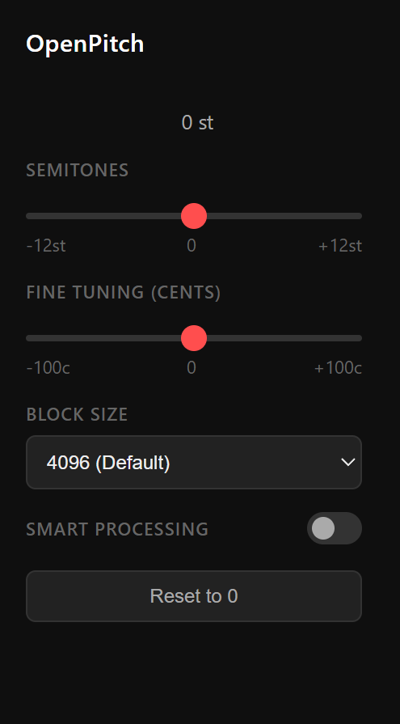

<div align="center">
  <h1>🎹 OpenPitch</h1>
  <p><b>Real-time, high-quality pitch shifting for YouTube.</b></p>
  <br />
  
</div>

<br />

OpenPitch is a simple Chrome extension that lets you change the pitch of YouTube videos.

It’s free. It’s open source. No time limits.

This project started because most pitch changer extensions are either paid or restrict basic functionality. This one doesn’t.

---

## Current Version (MVP)

Right now the extension:

- Adds a pitch slider from -12 to +12 semitones
- Works on YouTube
- Adjusts audio in real time

- Adjusts audio in real time using SoundTouch for proper pitch shifting without affecting speed.

---

## Project Structure

```

open-pitch/
│
├── assets/                     # Extension screenshots and icons
│   └── openpitch_extension.PNG
├── content.js                  # Audio processing engine
├── manifest.json               # Extension configuration
├── package.json                # Metadata (no build step)
├── popup.html                  # Popup UI
├── popup.js                    # UI logic and messaging
├── README.md                   # Project documentation
├── CONTRIBUTING.md             # Developer guidelines
└── soundtouch-web-audio.js     # SoundTouch DSP library

```

---

## How to Install (Developer Mode)

1. Clone the repository:


``` 
git clone https://github.com/KartikeyaKotkar/open-pitch.git
```


2. Open Chrome and go to:

```
chrome://extensions
```

3. Turn on Developer Mode (top right).

4. Click "Load unpacked".

5. Select the project folder.

6. Open YouTube and test the slider.

---

## How It Works

The popup sends the selected semitone value to the content script.

The content script uses the **Web Audio API** and **SoundTouch.js** to process the video's audio track in real time.

It captures the audio stream from the `<video>` element, pipes it through a pitch-shifter node, and outputs the result to the speakers. This allows for independent control over pitch (-12 to +12 semitones) while keeping the playback speed constant.

---

## Roadmap

- [Done] Replace playbackRate with real pitch shifting
- [Done] Fine-tune audio buffering for higher quality (Configurable Block Size & Smart Processing)
- [Done] Save last pitch value
- Add key presets
- Possibly support more platforms

---

## Contributing

If you want to improve the DSP, UI, or overall structure, feel free to open a pull request. 

Please read **[CONTRIBUTING.md](CONTRIBUTING.md)** first. It contains crucial details about the architecture, storage schema, messaging protocol, and hard rules for managing the Web Audio lifecycle cleanly without memory leaks.

---

## License

MIT

Use it, modify it, do whatever you want with it.
